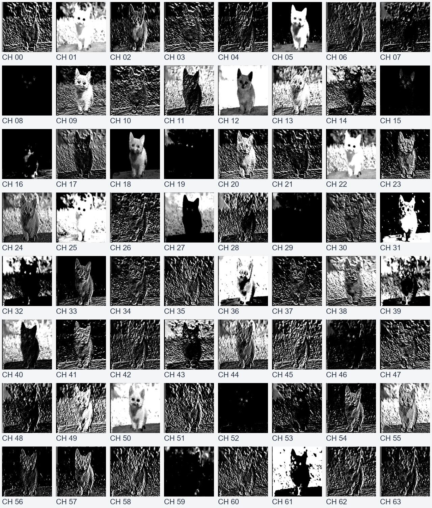
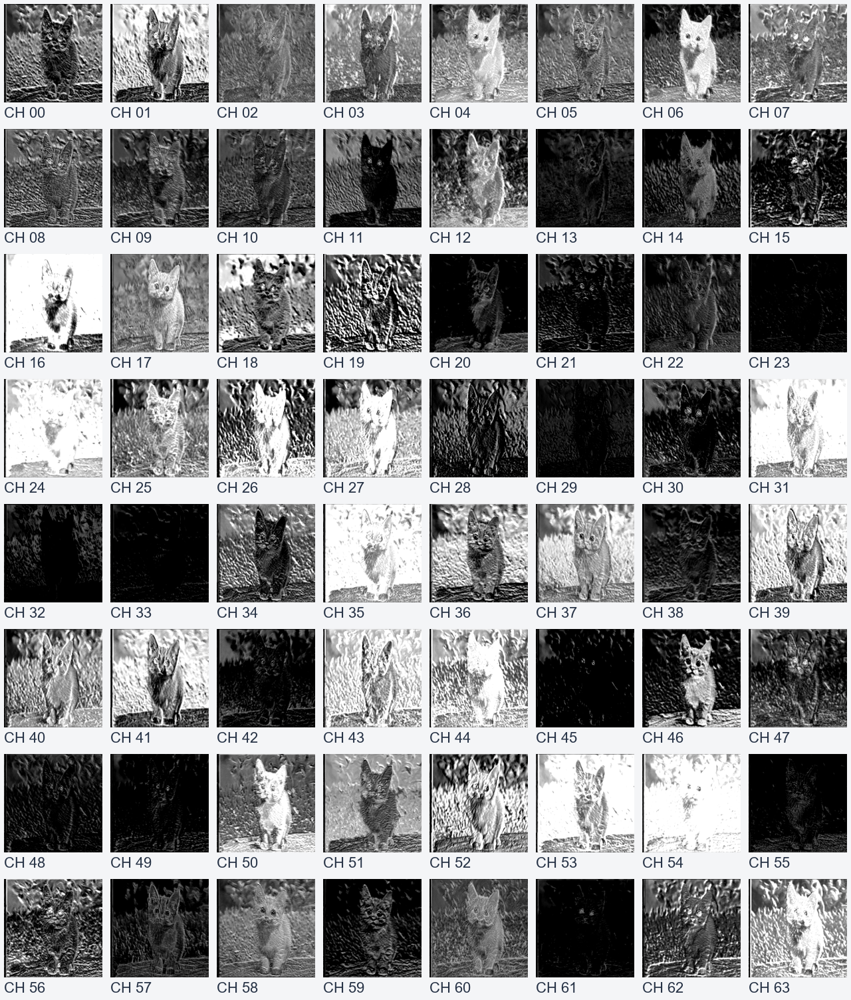
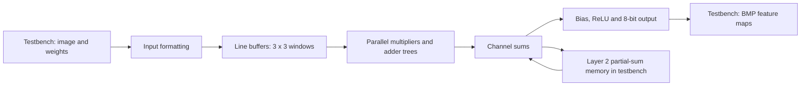

# VGG16 Convolution Accelerator

A Verilog implementation of the first two convolution layers of VGG16, developed for the Hardware Description Language course at National Sun Yat-sen University.

The design processes a 224 × 224 RGB image with 3 × 3 convolution, bias addition, and ReLU. Each layer produces 64 feature maps using a limited number of parallel input and output channels.

## Results

### Input Image


| Layer 1 — 64 Feature Maps | Layer 2 — 64 Feature Maps |
|:---:|:---:|
|  |  |

These previews show the archived BMP outputs from the original assignment. Full-resolution images are available in [layer1](layer1) and [layer2](layer2). The [original report](docs/HW5-report.pdf) includes architecture drawings and screenshots labeled as pre-simulation and post-simulation results.

### Synthesis Results

| Metric | Archived Result |
|:---|:---|
| Synthesis tool | Synopsys Design Compiler T-2022.03 |
| Standard-cell library | N16ADFP, `ss0p72vm40c` |
| Clock constraint | 10 ns (100 MHz target) |
| Reported path arrival time | 4.074222 ns |
| Reported setup slack | +5.910410 ns — MET |
| Total cell area | 79,016.033057 library area units |
| Total dynamic power | 7.6324 mW |
| Cell leakage power | 45.4914 µW |

Values come from the retained [timing](reports/1.timing_report_vgg16.txt), [area](reports/2.area_report_vgg16.txt), and [power](reports/3.power_report_vgg16.txt) reports dated November 27, 2025. They are synthesis estimates, not physical chip measurements. Power was estimated with unannotated inputs and sequential outputs; the timing report uses a zero-wire-load model. The original synthesis was not rerun for this repository release.

## Problem

Convolution repeatedly multiplies neighboring pixels by kernel weights and accumulates the results across input channels. The second layer has 64 input channels and 64 output channels, making a fully parallel implementation expensive.

This project uses line buffers to reuse neighboring pixels and processes channels in batches. It explores how to organize the convolution datapath, preserve partial sums between batches, and convert the accumulated values into visible feature maps.

## Implementation



### Line Buffers and Convolution

The testbench supplies a padded 226 × 226 image stream. Each line buffer stores 455 samples and exposes nine taps for a 3 × 3 window. Each `conv_3x3_ci` block computes nine products, combines them with an adder tree, and registers a 36-bit partial sum.

| Configuration | Layer 1 | Layer 2 |
|:---|:---|:---|
| Total input channels | 3 | 64 |
| Total output channels | 64 | 64 |
| Parallel input channels | 3 | 4 |
| Parallel output channels | 3 | 4 |
| Output batches | 22, with one useful channel in the last batch | 16 |
| Input groups per output batch | 1 | 16 |
| Output bit selection | `[11:4]` | `[14:7]` |

The top module instantiates separate Layer 1 and Layer 2 datapaths and selects their outputs with `layer_sel`. They use the same convolution building block but are separate hardware instances.

### Partial-Sum Accumulation

Layer 2 processes four input channels at a time. The testbench stores the partial sums and feeds them back through `psum_in_ch0`–`psum_in_ch3` for the next group. On the last input group, `is_last_group` enables bias addition and the final ReLU output.

The partial-sum memory, file access, and batch scheduling are implemented in the simulation testbench. A standalone hardware system would need its own memory interface and controller.

### Fixed-Point Output

Inputs are 8-bit pixels, weights and biases are signed 16-bit values, and accumulation uses signed 36-bit values. Layer 1 subtracts 128 from the incoming pixels; Layer 2 uses the previous layer's unsigned 8-bit outputs. ReLU sets negative results to zero, selects the configured output bits, and saturates values above 255.

## Data and Project Files

| Path | Description |
|:---|:---|
| [rtl/vgg16.v](rtl/vgg16.v) | Top module, both convolution layers, line buffer, adder tree, and ReLU |
| [presim/testbench.v](presim/testbench.v) | Image loading, weight loading, channel batching, partial-sum storage, and BMP output |
| [data](data) | Original input image, kernel weights, and biases |
| [layer1](layer1), [layer2](layer2) | Archived feature maps, 64 images per layer |
| [synthesis/delay_dc.tcl](synthesis/delay_dc.tcl) | Design Compiler synthesis flow |
| [reports](reports) | Archived timing, area, and power reports |
| [docs/HW5-report.pdf](docs/HW5-report.pdf) | Original assignment report |

The image and parameter files are retained from the assignment materials. Their upstream model checkpoint and preprocessing/export scripts were not included in the source folder.

## Running the Project

### RTL Simulation — Icarus Verilog

Install Icarus Verilog and Python 3, then run from the repository root:

```sh
python scripts/run_sim.py --compile-only
python scripts/run_sim.py
```

Generated images are written to `build/layer1/` and `build/layer2/`, keeping the archived results intact. Full-image simulation can take a long time because the testbench repeatedly streams images through register-based line buffers.

### RTL Simulation — Synopsys VCS

On a Linux environment with a licensed VCS installation:

```sh
python scripts/run_sim.py --simulator vcs
```

### Synthesis — Design Compiler

Update the library paths in `synthesis/delay_dc.tcl` for your licensed standard-cell environment, then run from the repository root:

```sh
dc_shell -f synthesis/delay_dc.tcl
```

New synthesis outputs are written to `build/synthesis/`. Standard-cell libraries are not included.

## Verification Scope

The repository release checks RTL/testbench compilation and the presence and readability of all 128 archived output images. It does not rerun the full two-layer simulation, synthesis, or gate-level simulation. The testbench produces images but does not contain a numerical golden-reference checker, so the previews should be read as visual results rather than proof of bit-exact agreement with a VGG16 software model.

See [implementation notes](docs/implementation-notes.md) for preserved behavior and the changes made when packaging the original HW5 folder.

---

This is a course project covering the first two VGG16 convolution layers. Pooling, the remaining layers, and end-to-end image classification are outside its scope.
